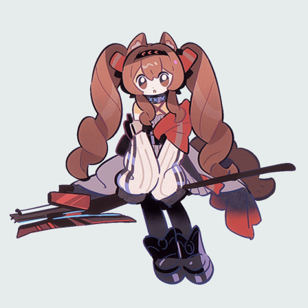
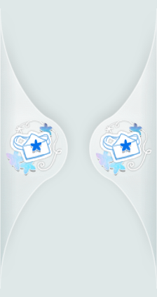

# 酸橙信使

一款轻量 macOS 桌面宠物。角色常驻桌面上层，根据鼠标悬浮、点击、长按、拖动、鼠标追随和屏幕边缘吸附播放对应动画。



> 本项目是非官方同人作品。公开分发当前《明日方舟》角色与活动素材前，发布者必须取得相应转载和再分发授权。具体边界见 [第三方素材声明](THIRD_PARTY_NOTICES.md)。

## 系统要求

- macOS 14.0 及更高版本
- Apple Silicon Mac
- 不需要录屏、通知和辅助功能权限

## 安装

1. 打开仓库的 **Releases** 页面。
2. 下载 `LimeCourier-<版本>-macos-arm64.zip` 和同名 `.sha256` 文件。
3. 在下载目录执行校验：

```bash
shasum -a 256 -c LimeCourier-<版本>-macos-arm64.zip.sha256
```

4. 解压 ZIP，将“酸橙信使.app”拖入“应用程序”文件夹。
5. 双击启动。应用通过菜单栏图标和角色右键菜单进行控制。

GitHub Release 中的正式安装包必须使用 Developer ID 签名并通过 Apple 公证。源码直接构建的临时签名版本仅用于开发测试。

## 互动

- 待机：持续循环播放菜单中选定的动作。
- 悬浮 `0.6 秒`：持续播放拍照动作，鼠标移出后返回待机。
- 单击：播放 `3 轮`纸飞机动作。
- 双击：播放 `3 轮`购物动作。
- 静止长按 `0.8 秒`：播放海边动作与星光反馈。
- 左右拖动：播放与移动方向一致的骑行动作。
- 边缘释放：在距离屏幕边缘 `42 pt` 内释放后吸附到边缘。
- 边缘送货：左右边缘停留 `1 秒`后，按对应方向播放一轮送货动画。
- 气泡吸附：送货结束后以 `0.3 秒`双平滑曲线收拢为半透明边缘气泡。
- 气泡唤回：鼠标在气泡停留 `0.4 秒`后返回桌面并播放探险动作。
- 鼠标追随：鼠标在任意位置静止 `1 秒`后，角色以 `150 pt/s` 移动并停在鼠标前 `56 pt`。



## 控制菜单

右键角色与菜单栏图标打开同一菜单。菜单包含显示状态、自主活动、鼠标追随、边缘气泡、始终置顶、待机动作、角色大小、动画速度、开机启动、重置位置和退出。

## 源码构建

```bash
swift test
./scripts/build_app.sh
open "dist/酸橙信使.app"
```

构建环境需要 Xcode 16 与 Swift 6。开发构建产物位于 `dist/酸橙信使.app`。

## 正式发布

完整的 Developer ID 签名、Apple 公证、GitHub Secrets 与标签发布步骤见 [GitHub 发布方案](PUBLISHING.md)。工作流根据 `v*` 标签自动创建 GitHub Release，上传经过公证的 ZIP 和 SHA-256 校验文件。

官方参考：[GitHub Releases](https://docs.github.com/en/repositories/releasing-projects-on-github)、[Apple Developer ID](https://developer.apple.com/support/developer-id/)、[Apple 公证流程](https://developer.apple.com/documentation/security/notarizing-macos-software-before-distribution)。
